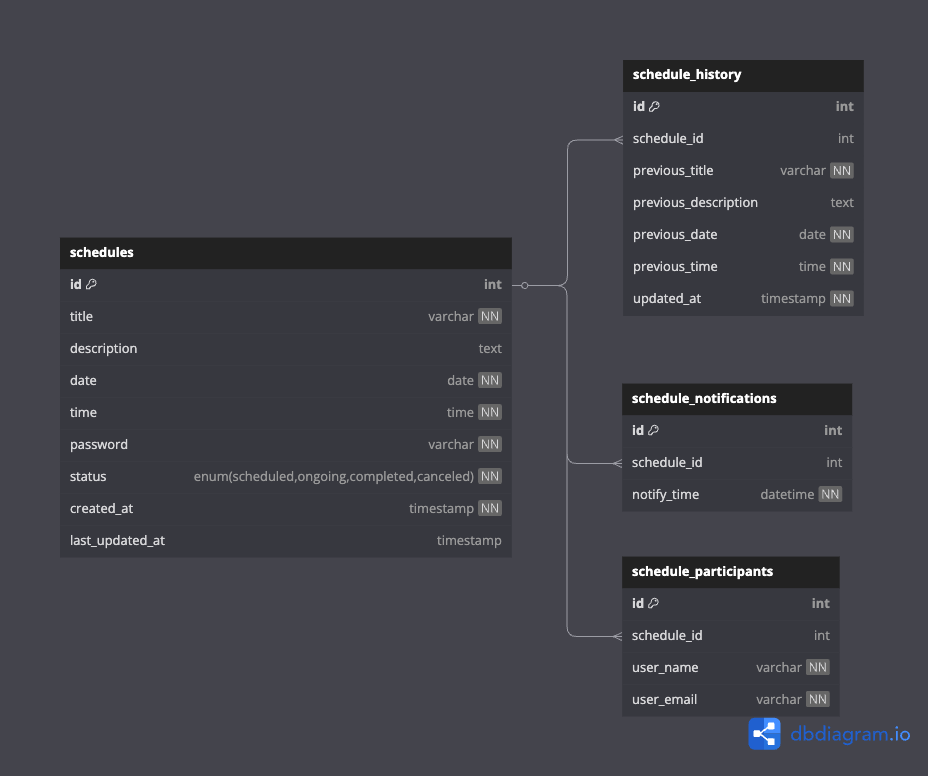

---

# 🗓️ Spring Scheduler - 일정 관리 시스템

## 프로젝트 소개
Spring Boot 기반의 일정 관리 시스템으로, 사용자가 일정을 생성, 수정, 삭제하고 알림을 설정할 수 있습니다.

---

## ERD 구조  
**아래는 DB 구조를 나타내는 ERD(Entity Relationship Diagram)입니다.**  


### **테이블 설명**
| 테이블명 | 설명 |
|---------|-------------------------|
| **schedules** | 기본 일정 정보를 저장하는 테이블 |
| **schedule_history** | 일정이 수정될 때마다 변경 내역을 저장하는 테이블 |
| **schedule_participants** | 일정에 참여하는 사용자 정보를 저장하는 테이블 |
| **schedule_notifications** | 일정에 대한 알림 정보를 저장하는 테이블 |

---

### **테이블 간 관계**
1. **`schedules(일정)` ↔ `schedule_history(일정 수정 이력)`** (`1:N`)
- 일정이 수정될 때마다, `schedule_history`에 이전 데이터가 기록됨.

2. **`schedules(일정)` ↔ `schedule_participants(참여자)`** (`1:N`)
- 하나의 일정에는 여러 명의 사용자가 참여할 수 있음.

3. **`schedules(일정)` ↔ `schedule_notifications(알림)`** (`1:N`)
- 하나의 일정에는 여러 개의 알림이 설정될 수 있음.

---

## API 명세  

### ✅ **1. 일정 생성 (Create)**
| 메서드 | 엔드포인트 | 설명 |
|--------|-----------|------|
| `POST` | `/schedules` | 새로운 일정을 생성합니다. |

#### 요청 (Request)
```json
{
  "title": "회의 일정",
  "description": "주간 회의 진행",
  "date": "2025-03-20",
  "time": "10:00:00",
  "password": "1234"
}
```
#### 응답 (Response)
```json
{
  "id": 1,
  "title": "회의 일정",
  "description": "주간 회의 진행",
  "date": "2025-03-20",
  "time": "10:00:00",
  "status": "scheduled",
  "created_at": "2025-03-19T15:00:00Z"
}
```

---

### ✅ **2. 일정 조회 (Read)**
| 메서드 | 엔드포인트 | 설명 |
|--------|-----------|------|
| `GET` | `/schedules/{id}` | 특정 일정 정보를 조회합니다. |

#### 응답 (Response)
```json
{
  "id": 1,
  "title": "회의 일정",
  "description": "주간 회의 진행",
  "date": "2025-03-20",
  "time": "10:00:00",
  "status": "scheduled",
  "created_at": "2025-03-19T15:00:00Z"
}
```

---

### ✅ **3. 일정 목록 조회 (List)**
| 메서드 | 엔드포인트 | 설명 |
|--------|-----------|------|
| `GET` | `/schedules` | 모든 일정 목록을 조회합니다. |

#### 응답 (Response)
```json
[
  {
    "id": 1,
    "title": "회의 일정",
    "date": "2025-03-20",
    "time": "10:00:00",
    "status": "scheduled"
  },
  {
    "id": 2,
    "title": "점심 약속",
    "date": "2025-03-21",
    "time": "12:30:00",
    "status": "scheduled"
  }
]
```

---

### ✅ **4. 일정 수정 (Update)**
| 메서드 | 엔드포인트 | 설명 |
|--------|-----------|------|
| `PUT` | `/schedules/{id}` | 특정 일정을 수정합니다. |

#### 요청 (Request)
```json
{
  "title": "주간 회의",
  "description": "팀 주간 회의 진행",
  "date": "2025-03-20",
  "time": "11:00:00",
  "password": "1234"
}
```
#### 응답 (Response)
```json
{
  "id": 1,
  "title": "주간 회의",
  "description": "팀 주간 회의 진행",
  "date": "2025-03-20",
  "time": "11:00:00",
  "status": "scheduled",
  "last_updated_at": "2025-03-19T16:00:00Z"
}
```

---

### ✅ **5. 일정 삭제 (Delete)**
| 메서드 | 엔드포인트 | 설명 |
|--------|-----------|------|
| `DELETE` | `/schedules/{id}` | 특정 일정을 삭제합니다. |

#### 요청 (Request)
```json
{
  "password": "1234"
}
```
#### 응답 (Response)
```json
{
  "message": "일정이 삭제되었습니다."
}
```

---

## SQL 테이블 생성 (`schedule.sql`)
**아래 SQL을 `schedule.sql` 파일에 작성하고 실행하여 데이터베이스 테이블을 생성합니다.**
```sql
-- 데이터베이스 생성 (없으면 생성)
CREATE DATABASE IF NOT EXISTS schedule_db;
USE schedule_db;

-- 일정 테이블 (기본 일정 정보 저장)
CREATE TABLE IF NOT EXISTS schedules (
                                         id INT AUTO_INCREMENT PRIMARY KEY,
                                         title VARCHAR(255) NOT NULL,
    description TEXT NULL,
    date DATE NOT NULL,
    time TIME NOT NULL,
    password VARCHAR(255) NOT NULL,
    status ENUM('scheduled', 'ongoing', 'completed', 'canceled') NOT NULL DEFAULT 'scheduled',
    created_at TIMESTAMP DEFAULT CURRENT_TIMESTAMP NOT NULL,
    last_updated_at TIMESTAMP NULL
    );

-- 일정 수정 이력 테이블 (수정할 때마다 기록) → `schedule_history`로 변경됨
CREATE TABLE IF NOT EXISTS schedule_history (
                                                id INT AUTO_INCREMENT PRIMARY KEY,
                                                schedule_id INT NOT NULL,
                                                previous_title VARCHAR(255) NOT NULL,
    previous_description TEXT NULL,
    previous_date DATE NOT NULL,
    previous_time TIME NOT NULL,
    updated_at TIMESTAMP DEFAULT CURRENT_TIMESTAMP NOT NULL,
    FOREIGN KEY (schedule_id) REFERENCES schedules(id) ON DELETE CASCADE
    );

-- 일정 참여자 테이블 (일정에 여러 명이 참여 가능)
CREATE TABLE IF NOT EXISTS schedule_participants (
                                                     id INT AUTO_INCREMENT PRIMARY KEY,
                                                     schedule_id INT NOT NULL,
                                                     user_name VARCHAR(255) NOT NULL,
    user_email VARCHAR(255) NOT NULL,
    FOREIGN KEY (schedule_id) REFERENCES schedules(id) ON DELETE CASCADE
    );

-- 일정 알림 테이블 (일정마다 여러 개의 알림 설정 가능)
CREATE TABLE IF NOT EXISTS schedule_notifications (
                                                      id INT AUTO_INCREMENT PRIMARY KEY,
                                                      schedule_id INT NOT NULL,
                                                      notify_time DATETIME NOT NULL,
                                                      FOREIGN KEY (schedule_id) REFERENCES schedules(id) ON DELETE CASCADE
    );

```
---

## 이후 추가할 내용 (추후 정리)
- 프로젝트 실행 방법
- 기타 기술 스택
